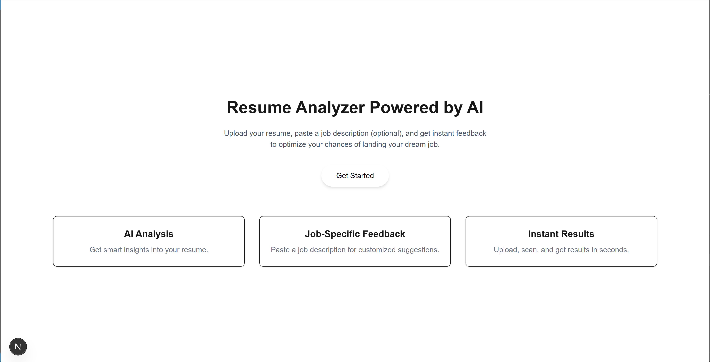

# Resume Analyzer

A modern web application that analyzes resumes, provides scores and actionable feedback to help job seekers improve their resumes and increase their chances of landing interviews.



## Features

- **Resume Parsing**: Upload resumes in PDF, DOCX, or TXT formats
- **Comprehensive Analysis**: Get detailed feedback on various resume sections
- **Score Visualization**: See your resume's overall score with a dynamic circular progress indicator
- **Section-by-Section Breakdown**: Detailed scoring and feedback for each resume section
- **Improvement Suggestions**: Actionable recommendations to enhance your resume
- **Statistics**: Visual representation of your resume's strengths and weaknesses

## Tech Stack

- **Frontend**: Next.js, React, TypeScript, Tailwind CSS
- **PDF Processing**: Server-side PDF parsing
- **Document Processing**: Mammoth.js for DOCX parsing
- **Deployment**: Vercel

## Getting Started

### Prerequisites

- Node.js 16.x or later
- npm or yarn

### Installation

1. Clone the repository
```bash
git clone https://github.com/yourusername/resume-analyzer.git
cd resume-analyzer
```

2. Install dependencies
```bash
npm install
# or
yarn install
```

3. Run the development server
```bash
npm run dev
# or
yarn dev
```

4. Open [http://localhost:3000](http://localhost:3000) in your browser

## Usage

1. **Upload Resume**: Click the "Upload and Scan Resume" button to select your resume file
2. **View Analysis**: After processing, view your overall score and section-by-section feedback
3. **Implement Suggestions**: Follow the actionable recommendations to improve your resume
4. **Rescan**: After making changes, upload your updated resume to see your improved score

## Project Structure

```
resume-analyzer/
├── components/            # React components
│   ├── ResumeAnalysis.tsx # Main analysis component
│   ├── ResumeScoreCard.tsx # Score visualization component
│   └── ...
├── lib/                   # Utility functions
│   ├── extractText.tsx    # Document text extraction
│   └── ...
├── pages/                 # Next.js pages
│   ├── api/               # API routes
│   │   └── extract-text.ts # Document processing API
│   ├── _app.tsx
│   └── index.tsx
├── public/                # Static assets
├── styles/                # CSS styles
└── ...
```

## Document Processing

The application supports the following document formats:

- **PDF**: Processed using server-side API for reliable text extraction
- **DOCX**: Processed using Mammoth.js for accurate content extraction
- **TXT**: Directly read as plain text

## Scoring System

The resume analysis provides scores on a scale of 0-100% with the following color-coded indicators:

- **90-100%**: Dark Green (excellent)
- **80-89%**: Green (very good)
- **70-79%**: Light Green (good)
- **60-69%**: Blue (above average)
- **50-59%**: Amber/Yellow (average)
- **40-49%**: Orange (below average)
- **0-39%**: Red (needs improvement)

Individual resume sections are also scored from 1-10 with a similar color scheme:
- **8-10**: Green (excellent)
- **6-7**: Blue (good)
- **4-5**: Yellow (average)
- **2-3**: Orange (below average)
- **1**: Red (poor)

## API Routes

### `/api/extract-text`
Processes uploaded document files and extracts text content.

- **Method**: POST
- **Parameters**: File in FormData
- **Response**: JSON with extracted text

## Deployment

The application is configured for easy deployment on Vercel:

```bash
npm run build
# or
vercel
```

## Contributing

1. Fork the repository
2. Create a feature branch (`git checkout -b feature/amazing-feature`)
3. Commit your changes (`git commit -m 'Add some amazing feature'`)
4. Push to the branch (`git push origin feature/amazing-feature`)
5. Open a Pull Request

## License

This project is licensed under the MIT License - see the LICENSE file for details.

## Acknowledgments

- [Next.js](https://nextjs.org/)
- [Tailwind CSS](https://tailwindcss.com/)
- [Mammoth.js](https://github.com/mwilliamson/mammoth.js)
- [PDF-Parse](https://github.com/modesty/pdf2json)
